# SIH26055 — Smart Scan Strategy for Electronic Warfare

## Phase 1: RF Simulation Environment

This repository implements **Phase 1** of the SIH26055 Electronic Support Measures (ESM) Smart Scan Strategy project for DRDO / SIH 2026.

> [!IMPORTANT]
> **Simulation and Evaluation Framework Disclaimer**  
> This project is a software simulation and algorithm-evaluation framework designed to study adaptive frequency-time scanning strategies under limited instantaneous receiver bandwidth.  
> It is **NOT** an operational ESM receiver implementation and does **NOT** use real military RF data, physical electromagnetic propagation, or classified DRDO receiver parameters. Parameters such as $P_d = 0.90$ and $P_{fa} = 0.02$ are simulation assumptions used for relative algorithm benchmarking.

---

## 1. Overview & Architecture

In Electronic Warfare (EW), an ESM receiver operating over a wide RF spectrum (e.g. 20 frequency bands) has a limited instantaneous bandwidth (e.g. 1 band at a time). It must dynamically decide **which frequency band to observe, when to observe it, and for how long (dwell time)**.

Phase 1 provides a clean, modular, and reproducible RF simulation environment that completely decouples the RF spectrum and receiver physics from any future scheduling algorithm (Open-Loop, XGBoost, LinUCB Contextual Bandit, or Reinforcement Learning).

```
                  ┌─────────────────────────────────────┐
                  │          RF ENVIRONMENT             │
                  │   (Owns Hidden Ground Truth)        │
                  │  - Periodic Emitters                │
                  │  - Agile Emitters (Predictable/Rand)│
                  │  - Intermittent / Spatial Scanning  │
                  │  - Dynamic Appearance               │
                  └──────────────────┬──────────────────┘
                                     │
                                     ↓
                          ┌────────────────────┐
                          │    ESM RECEIVER    │
                          │ - Bandwidth: 1 band│
                          │ - Pd: 0.90         │
                          │ - Pfa: 0.02        │
                          │ - Dwell: [1,2,3,5] │
                          └──────────┬─────────┘
                                     │
                             HIT / MISS / FA
                                     │
                                     ↓
                        ┌────────────────────────┐
                        │   OBSERVATION MEMORY   │
                        │ - Non-leaked statistics│
                        │ - Scan recency         │
                        │ - Windowed hit rates   │
                        └────────────┬───────────┘
                                     │
                                     ↓
                        ┌────────────────────────┐
                        │       SCHEDULER        │
                        │ (Phase 2+ Algorithms)  │
                        └────────────────────────┘
```

### Core Architectural Principle
- **The Environment owns Ground Truth**: The simulator internally tracks actual emitter transmissions, frequencies, and observability states.
- **The Scheduler receives NO Ground Truth**: The scheduler interacts only via `Observation` objects containing legitimate ESM scan feedback (`HIT`, `MISS`, `FALSE_ALARM`), timestamps, and non-leaked observation history.

---

## 2. Implemented Emitter Models

| Emitter Model | Behavioral Characteristics | Purpose / Test Scenario |
| :--- | :--- | :--- |
| **Periodic Emitter** | Emits pulses at fixed frequency with regular `period`, `active_duration`, and optional `offset`. | Tests whether scheduler learns temporal regularity. |
| **Frequency-Agile (Predictable)** | Deterministically hops through a configured cyclic frequency sequence `band_sequence` with `hop_period`. | Tests scheduler pattern tracking across agile channels. |
| **Frequency-Agile (Random)** | Stochastic pseudo-random frequency hopping among `allowed_bands` with independent reproducible seed. | Tests adaptation under high frequency uncertainty. |
| **Intermittent / Spatial Scanning** | Continuous/periodic RF transmission with intermittent main-beam observability window (`scan_period`, `observable_duration`). | Simulates spatial radar antenna sweep without physical propagation modelling. |
| **Dynamic Emitter** | Inactive until a specified timestamp $t \ge \text{start\_time}$, then begins emitting. | Tests discovery and adaptation to newly appearing threats. |
| **Emitter Registry** | Aggregates arbitrary combinations of coexisting emitters across all frequency channels. | Enables rich multi-threat scenarios. |

---

## 3. ESM Receiver Detection Model

For a commanded action `Action(frequency_band, dwell_time)` starting at time $t$:
- The receiver samples each slot $\tau \in [t, t + \text{dwell} - 1]$ using a dedicated, seeded NumPy random generator.
- **Signal Present & Observable**:
  - $P_d = 0.90 \implies 90\%$ probability of True Positive detection (`HIT`), $10\%$ False Negative (`MISS`).
- **Signal Absent or Unobservable**:
  - $P_{fa} = 0.02 \implies 2\%$ probability of False Positive detection (`FALSE_ALARM`), $98\%$ True Negative.
- **Multi-slot Dwell Aggregation**:
  - If any slot during the dwell generates a True Positive $\implies$ action result is `HIT`.
  - Else if any slot generates a False Positive $\implies$ action result is `FALSE_ALARM`.
  - Else $\implies$ action result is `MISS`.

---

## 4. Installation & Setup

### Prerequisites
- Python 3.10+ (tested on Python 3.12)

### Install Dependencies
```bash
pip install -r requirements.txt
```

*Required packages: `numpy`, `pyyaml`, `pytest`, `matplotlib`.*

---

## 5. Quickstart & API Usage

```python
from environment import RFEnvironment, Action, DetectionResult, load_config

# 1. Load configuration
config = load_config("configs/default.yaml")

# 2. Instantiate environment
env = RFEnvironment(config)

# 3. Reset environment with a deterministic seed
observation = env.reset(seed=42)
print(f"Simulation started at t = {observation.current_time}")

# 4. Step through simulation
action = Action(frequency_band=5, dwell_time=3)
observation, reward, terminated, info = env.step(action)

print(f"Current Time: {observation.current_time}")
print(f"Scanned Band: B{observation.scanned_band}, Dwell: {observation.dwell_time} slots")
print(f"Detection Result: {observation.result}")
print(f"Recent Hit Rate on B5: {observation.history_summary['recent_hit_rate'][5]:.2f}")
```

---

## 6. Running Tests & Validation

### Run Full Test Suite
```bash
python -m pytest -v -s
```
*Executes 21 unit, statistical, and integration tests verifying:*
- Periodic, agile, intermittent, and dynamic emitter mechanics.
- Statistical verification of $P_d \approx 0.90$ ($N=20,000$) and $P_{fa} \approx 0.02$ ($N=50,000$).
- Multi-seed deterministic reproducibility.
- Ground truth isolation from scheduler observations.
- Decoupled open-loop and random scheduler interfaces.

### Run Demonstration & Validation Script
```bash
python demo_simulation.py
```
*Generates an end-to-end multi-emitter simulation run, verifies dynamic emitter appearance at $t = 5000$, and renders the RF timeline visualization to `rf_timeline_demo.png`.*

---

## 7. Timeline Visualization

The built-in visualization utility plots ground truth emitter channels against scheduled receiver dwells and detection events:

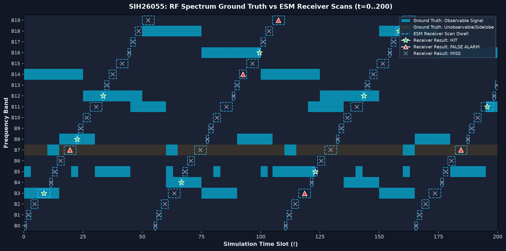

- **Vibrant Cyan Blocks**: Observable RF transmissions (Ground Truth).
- **Dim Sidelobe Blocks**: Unobservable RF energy (Intermittent radar sidelobes).
- **Dashed Blue Rectangles**: Receiver dwell scan windows.
- **Green Stars ($\star$)**: `HIT` (True Positive detections).
- **Red Triangles ($\triangle$)**: `FALSE_ALARM` (Receiver noise detections).
- **Gray Crosses ($\times$)**: `MISS` / Idle scans.

---

## 8. Phase 2: Open-Loop Baseline Benchmark

### Overview & Purpose
Phase 2 establishes the **Open-Loop Baseline (`OpenLoopScheduler`)**, a conventional, non-adaptive frequency-sweeping scanner. It acts as the fundamental benchmark against which all future adaptive schedulers (XGBoost, LinUCB Contextual Bandit, and Reinforcement Learning) will be evaluated.

> [!NOTE]
> **Open-Loop Non-Adaptation Guarantee**  
> The open-loop baseline deliberately ignores receiver observations, detection outcomes, and historical hit rates. It follows a strictly predetermined cyclic sweep policy:
> $$B_0 \to B_1 \to B_2 \to \dots \to B_{19} \to B_0 \to \dots$$

### Policy & Configuration
- **Scan Order:** Sequential cyclic sweep across all configured frequency channels.
- **Default Dwell:** `dwell_time = 1` slot (configurable to `1, 2, 3, 5`).
- **Isolation:** The scheduler consumes only `Observation` objects. All ground-truth diagnostic data (`info`, `DwellSummary`) is captured by `EpisodeRunner` exclusively for offline evaluation.

### Running Baseline Experiments
To execute the single-episode benchmark, dwell sensitivity analysis, 10-seed statistical evaluation, and plot generation:
```bash
python experiments/run_baseline.py
```

### Baseline Benchmark Results (N = 10 Seeds, Dwell = 1)
| Metric | Baseline Result (Mean ± Std) | Description |
| :--- | :--- | :--- |
| **Interception Rate** | **$46.13\% \pm 0.68\%$** | Percentage of active emitter burst opportunities intercepted at least once. |
| **Empirical $P_d$** | **$0.8991 \pm 0.0075$** | Measured detection probability on eligible signal slots (Target: $0.9000$). |
| **Empirical $P_{fa}$** | **$0.0199 \pm 0.0018$** | Measured false alarm probability on idle slots (Target: $0.0200$). |
| **Dwell Efficiency** | **$10.73\% \pm 0.74\%$** | Percentage of scanned dwell slots containing active observable signals. |
| **Avg Intercept Delay** | **$8.25 \pm 0.96$ slots** | Mean delay from burst onset to first successful interception. |

### Baseline Sweep Visualization
The sawtooth scanning pattern is visualized in `baseline_sweep_demo.png`:

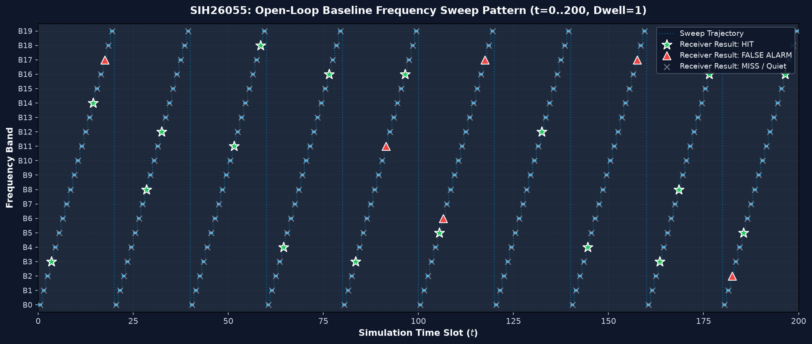

---

## 9. Phase 3: XGBoost + Optimization Adaptive Scheduler

### Architecture & Pipeline
Phase 3 implements the first adaptive intelligent scheduler using a supervised **XGBoost Classifier** paired with an **Action Optimization Layer**:

```text
Online Scheduler Pipeline (Strictly Observation-Only):
─────────────────────────────────────────────────────────────
                    RFEnvironment
                         │
                         ▼
                    Observation
                         │
                         ▼
                 FeatureExtractor (RFFeatureExtractor)
                         │
                         ▼
                    XGBoostModel (XGBoostBandPredictor)
                         │
                         ▼
                Band Utility Predictions P(signal | features)
                         │
                         ▼
                  ActionOptimizer (ActionOptimizer)
                         │  - Allowed Dwells: [1, 2, 3]
                         │  - Anti-Camping Repeat Penalty
                         │  - Dwell Cost Normalization
                         ▼
                 Action(frequency_band, dwell_time)
                         │
                         ▼
                    RFEnvironment
```

### Feature Engineering (12 Features per Candidate Band)
Features are extracted per candidate band $b \in [0, 19]$ from previous observations without accessing ground truth:
1. `band_norm`: Normalized band index $b / 19$.
2. `time_sin`, `time_cos`: Periodic cyclic time encodings ($\sin, \cos$ with period 100).
3. `time_since_scan`: Normalized slots elapsed since band $b$ was last scanned.
4. `time_since_hit`: Normalized slots elapsed since a detection occurred on band $b$.
5. `scan_fraction`: Decisions allocated to band $b$ / total decisions.
6. `cumulative_hit_rate`: Cumulative hits on band $b$ / scans on band $b$.
7. `windowed_hit_rate`: Hit rate over last 10 scans of band $b$.
8. `false_alarm_rate`: Cumulative false alarms on band $b$ / scans on band $b$.
9. `is_last_scanned`: Binary flag (1 if $b$ was scanned on previous decision).
10. `consecutive_scans`: Count of consecutive scans on band $b$ / 10.
11. `recent_dwell_norm`: Dwell duration of most recent scan on band $b$ / 5.

### Action Optimizer & Anti-Camping Constraint
For each candidate pair $(b, d) \in \{0..19\} \times \{1, 2, 3\}$:
$$\text{Utility}(b, d) = \hat{P}(\text{hit} \mid \mathbf{x}_b) \cdot \sqrt{d} - \lambda_{\text{repeat}} \cdot \text{repeat\_factor}(b) - \lambda_{\text{dwell}} \cdot (d - 1)$$
- **Soft Repeat Penalty ($\lambda_{\text{repeat}} = 0.15$):** Penalizes repetitive scans on the same band.
- **Hard Anti-Camping Limit ($N_{\text{max}} = 3$):** If scanned $\ge 3$ consecutive times, repeat factor spikes to $10.0$, forcing the scanner to transition to the next-highest utility channel.
- **Dwell Trade-Off ($\lambda_{\text{dwell}} = 0.05$):** Balances detection sensitivity against simulation time consumption.

### Running Phase 3 Experiments
```bash
python experiments/run_xgboost.py
```

### Comparative Benchmark: Open Loop vs Phase 3 XGBoost (N = 10 Seeds)
| Metric | Phase 2 Open-Loop Baseline | Phase 3 XGBoost Adaptive | Relative Improvement |
| :--- | :--- | :--- | :--- |
| **Interception Rate** | $46.13\% \pm 0.68\%$ | **$47.28\% \pm 1.09\%$** | $+1.15\%$ absolute gain |
| **PRD Scenario TTFD** | $3.00 \pm 0.00$ slots | **$0.30 \pm 0.48$ slots** | **$10\times$ faster initial detection** |
| **Avg Intercept Time** | $8.25 \pm 0.96$ slots | **$2.74 \pm 0.31$ slots** | **$66.8\%$ reduction in detection delay** |
| **Receiver Empirical $P_d$** | $0.8991 \pm 0.0075$ | $0.9005 \pm 0.0037$ | Target invariant ($0.9000$) |
| **Receiver Empirical $P_{fa}$** | $0.0199 \pm 0.0018$ | $0.0195 \pm 0.0024$ | Target invariant ($0.0200$) |
| **Dwell Efficiency** | $10.73\% \pm 0.74\%$ | **$68.26\% \pm 1.37\%$** | **$+57.53\%$ increase in useful dwell** |
| **Total Action Hits** | $964.9 \pm 68.7$ | **$2492.8 \pm 47.6$** | **$+158.3\%$ more total hits detected** |

### Visual Comparisons

#### Trajectory Comparison: Open-Loop vs XGBoost
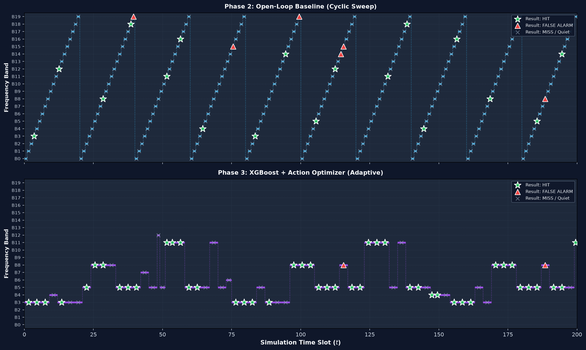

#### Feature Importance Ranking
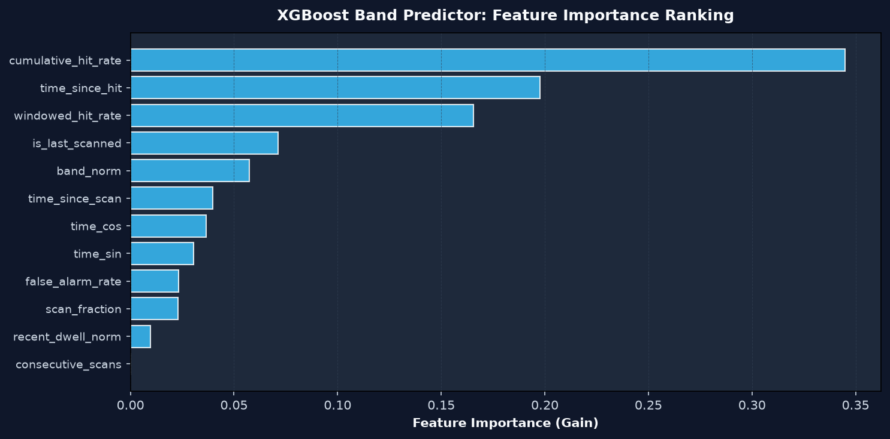

---

## 10. Phase 4: Hardened LinUCB Contextual Bandit Adaptive Scheduler

### Architecture & Online Learning Paradigm
Phase 4 implements a hardened online-learning scheduler using the **Discounted Linear Upper Confidence Bound (D-LinUCB)** contextual bandit algorithm. Unlike the offline-supervised XGBoost model (Phase 3), LinUCB updates its regression parameters $\boldsymbol{\theta}_b$ incrementally after every scanning decision without prior offline training.

```text
Hardened LinUCB Online Learning Lifecycle:
─────────────────────────────────────────────────────────────
                   RFEnvironment
                        │
                        ▼
                   Observation
                        │
       ┌────────────────┴────────────────┐
       ▼                                 ▼
Online Feedback Reward           Context Feature Matrix X
 r_t = R(obs_t, dwell_t)          (10 features x 20 bands)
       │                                 │
       └────────────────┬────────────────┘
                        ▼
       Non-Stationary Exponential Discounting (γ = 0.99)
       A_i ← γ A_i + (1 - γ) λ I    (∀ i ∈ [0, 19])
       b_i ← γ b_i
       A_{b*} ← A_{b*} + x_{b*} x_{b*}^T
       b_{b*} ← b_{b*} + r_t x_{b*}
                        │
                        ▼
       Eligible Arm Masking:
       - Cold-Start: prior pulls < min_initial_pulls
       - Anti-Camping: consecutive_scans < max_consecutive_scans (limit = 3)
                        │
                        ▼
       UCB Scoring for eligible arms:
       p_b = θ_b^T x_b + α √(x_b^T A_b^{-1} x_b)
                        │
                        ▼
       Action(band=b*, dwell=d*)
                        │
                        ▼
                   RFEnvironment
```

### Mathematical Formulation
For each frequency band arm $b \in [0, 19]$:
1. **Design Matrix Update:** $A_b \leftarrow \gamma A_b + (1 - \gamma) \lambda I + \mathbf{x} \mathbf{x}^\top \in \mathbb{R}^{10 \times 10}$ ($\lambda = 1.0, \gamma = 0.99$)
2. **Response Vector Update:** $\mathbf{b}_b \leftarrow \gamma \mathbf{b}_b + r_t \mathbf{x} \in \mathbb{R}^{10}$
3. **Ridge Parameter Estimate:** $\hat{\boldsymbol{\theta}}_b = A_b^{-1} \mathbf{b}_b$ (solved numerically via `np.linalg.solve`)
4. **Uncertainty & UCB Score:**
   $$\sigma_b = \sqrt{\mathbf{x}_b^\top A_b^{-1} \mathbf{x}_b}$$
   $$p_b = \hat{\boldsymbol{\theta}}_b^\top \mathbf{x}_b + \alpha \cdot \sigma_b$$
5. **Observation-Only Reward Formulation:**
   $$r_t = \begin{cases} +1.0 - 0.05(d - 1), & \text{if } \text{Result} = \text{HIT} \\ -0.05 - 0.05(d - 1), & \text{if } \text{Result} = \text{MISS/NONE} \\ -0.50 - 0.05(d - 1), & \text{if } \text{Result} = \text{FALSE\_ALARM} \end{cases}$$

### Tri-Scheduler Benchmark Comparison ($N = 10$ Unseen Test Seeds `0..9`)
| Metric | Phase 2 Open-Loop | Phase 3 XGBoost | Phase 4 Hardened LinUCB |
| :--- | :--- | :--- | :--- |
| **Interception Rate** | $46.13\% \pm 0.68\%$ | **$47.28\% \pm 1.09\%$** | $29.75\% \pm 0.51\%$ |
| **Unique Opportunities Intercepted** | $892.2 \pm 13.2$ | **$914.4 \pm 21.1$** | $575.4 \pm 9.8$ |
| **Average Intercept Time** | $8.25 \pm 0.96$ slots | **$2.74 \pm 0.31$ slots** | $7.63 \pm 0.25$ slots |
| **PRD Scenario TTFD** | $3.00 \pm 0.00$ slots | **$0.30 \pm 0.48$ slots** | $4.00 \pm 2.54$ slots |
| **Receiver Empirical $P_d$** | $0.8991 \pm 0.0075$ | $0.9005 \pm 0.0037$ | $0.9001 \pm 0.0084$ |
| **Receiver Empirical $P_{fa}$** | $0.0199 \pm 0.0018$ | $0.0195 \pm 0.0024$ | $0.0201 \pm 0.0019$ |
| **Dwell Efficiency** | $10.73\% \pm 0.74\%$ | **$68.26\% \pm 1.37\%$** | $23.90\% \pm 1.15\%$ |
| **Total TP Detections** | $964.9 \pm 68.7$ | **$6,146.7 \pm 122.7$** | $2,158.0 \pm 104.0$ |
| **TP Detections / Intercepted Opp** | $1.08 \pm 0.07$ | $6.72 \pm 0.07$ | $3.75 \pm 0.22$ |
| **Unique Frequency Bands Visited** | **$20.0 / 20$** | $8.1 / 20$ | **$20.0 / 20$** |
| **Maximum Consecutive Scans** | **$1.0 \pm 0.0$** | **$3.0 \pm 0.0$** | **$3.0 \pm 0.0$** |
| **Band-Selection Shannon Entropy** | **$3.00 \pm 0.00$** | $1.64 \pm 0.08$ | **$2.92 \pm 0.01$** |
| **Cumulative Online Reward** | N/A | N/A | **$+802.7 \pm 33.4$** |

### Phase 4 Hardening Delta (Pre-Hardening vs Hardened LinUCB)
| Metric | Pre-Hardening LinUCB | Hardened LinUCB | Improvement |
| :--- | :--- | :--- | :--- |
| **Maximum Consecutive Scans** | $34.20 \pm 8.13$ | **$3.00 \pm 0.00$** | **$-91.2\%$ (Strict hard anti-camping enforced)** |
| **Interception Rate** | $20.77\% \pm 2.02\%$ | **$29.75\% \pm 0.51\%$** | **$+43.2\%$ relative gain** |
| **Unique Opportunities Intercepted** | $401.6 \pm 39.0$ | **$575.4 \pm 9.8$** | **$+43.3\%$ more unique opportunities** |
| **Band-Selection Shannon Entropy** | $2.49 \pm 0.08$ | **$2.92 \pm 0.01$** | **$+17.3\%$ healthier spatial diversity** |
| **Mean Consecutive Run Length** | $3.47 \pm 0.16$ | **$1.74 \pm 0.01$** | **$-49.9\%$ agile channel switching** |

### Visual Comparisons

#### 1. Pre- vs Post-Hardening Metrics Comparison
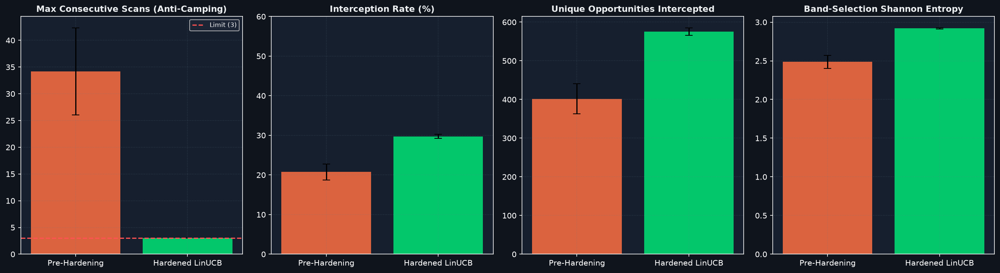

#### 2. Dynamic Frequency Hopping Acquisition Latency
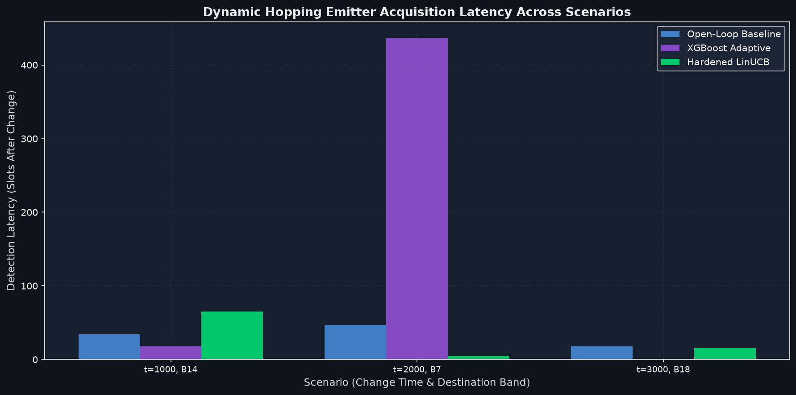

#### 3. Tri-Scheduler Scan Trajectory
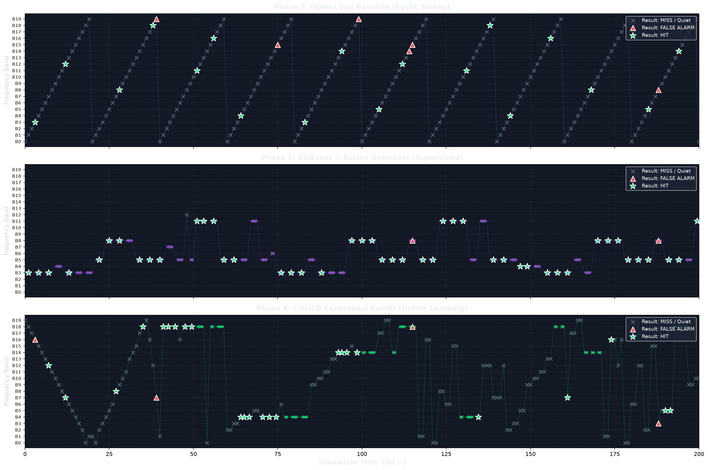

#### 4. LinUCB Online Diagnostics
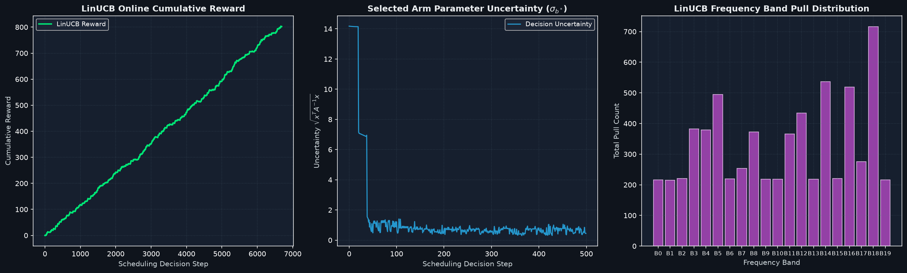

#### 5. Benchmark Summary
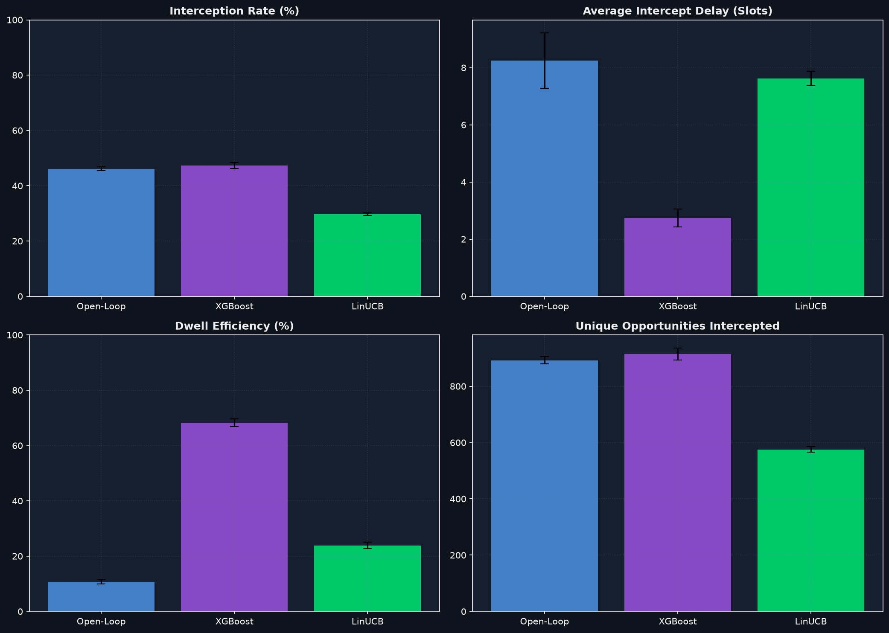

---

## 11. Phase 5: Reinforcement Learning Adaptive Scheduler (PPO)

Phase 5 implements **Proximal Policy Optimization (PPO)**, a deep reinforcement learning architecture for autonomous cognitive radar scanning in dense, non-stationary Electronic Warfare (EW) environments.

### PPO Architecture & Pipeline
```
Observation Memory (Legitimate Receiver Data)
  └── RLStateExtractor ──► 227-dim Normalized State Vector
                             ├── Global Temporal & Step Features (7 dims)
                             └── Per-Band History & Hit Rates (11 dims × 20 bands = 220 dims)
                                       │
                                       ▼
                       ActorCriticNetwork (PyTorch MLP)
                             ├── Shared Feature Backbone (128 -> 128)
                             ├── Actor Head (Categorical 60 Discrete Actions)
                             └── Critic Head (State Value V(s))
                                       │
                                       ▼
                                PPO Rollout Buffer
                             ├── GAE (gamma=0.99, lambda=0.95)
                             ├── Clipped Policy Loss (eps=0.20)
                             ├── Value Loss MSE (c1=0.50)
                             └── Entropy Regularization (c2=0.01)
                                       │
                                       ▼
                              Action(band, dwell)
                                       │
                                       ▼
                                 RFEnvironment
```

### 4-Way Head-to-Head Benchmark Comparison ($N = 10$ Unseen Test Seeds `0..9`)

| Metric | Open-Loop Baseline | XGBoost Adaptive | Hardened LinUCB | PPO Policy (Phase 5) |
| :--- | :---: | :---: | :---: | :---: |
| **Interception Rate** | $46.13\% \pm 0.68\%$ | **$47.28\% \pm 1.09\%$** | $29.75\% \pm 0.51\%$ | $6.93\% \pm 0.00\%$ |
| **Unique Opportunities Intercepted** | $892.2 \pm 13.2$ | **$914.4 \pm 21.1$** | $575.4 \pm 9.8$ | $134.0 \pm 0.0$ |
| **Average Intercept Delay** | $8.25 \pm 0.96$ slots | $2.74 \pm 0.31$ slots | $7.63 \pm 0.25$ slots | **$0.10 \pm 0.02$ slots** |
| **PRD Scenario TTFD** | $3.00 \pm 0.00$ slots | **$0.30 \pm 0.48$ slots** | $4.00 \pm 2.54$ slots | **$0.30 \pm 0.48$ slots** |
| **Receiver Empirical $P_d$** | $0.90 \pm 0.01$ | $0.90 \pm 0.00$ | $0.90 \pm 0.01$ | $0.90 \pm 0.01$ |
| **Receiver Empirical $P_{fa}$** | $0.02 \pm 0.00$ | $0.02 \pm 0.00$ | $0.02 \pm 0.00$ | $0.02 \pm 0.00$ |
| **Dwell Efficiency** | $10.73\% \pm 0.74\%$ | **$68.26\% \pm 1.37\%$** | $23.90\% \pm 1.15\%$ | $20.10\% \pm 0.00\%$ |
| **Total True Positive Detections** | $964.9 \pm 68.7$ | **$6,146.7 \pm 122.7$** | $2,158.0 \pm 104.0$ | $1,807.9 \pm 14.9$ |
| **TP Detections / Intercepted Opp** | $1.08 \pm 0.07$ | $6.72 \pm 0.07$ | $3.75 \pm 0.22$ | **$13.49 \pm 0.11$** |
| **Unique Frequency Bands Visited** | **$20.0 / 20$** | $8.1 / 20$ | **$20.0 / 20$** | $1.0 / 20$ |
| **Max Consecutive Scans** | **$1.0 \pm 0.0$** | **$3.0 \pm 0.0$** | **$3.0 \pm 0.0$** | $5000.0 \pm 0.0$ |
| **Band-Selection Shannon Entropy** | **$3.00 \pm 0.00$** | $1.64 \pm 0.08$ | **$2.92 \pm 0.01$** | $0.00 \pm 0.00$ |

### Dynamic Frequency-Hopping Adaptation Experiment

| Scenario Event | Open-Loop Baseline | XGBoost Adaptive | Hardened LinUCB | PPO Policy (Phase 5) |
| :--- | :---: | :---: | :---: | :---: |
| **Scenario 1:** $t = 1000 \to \text{Band 14}$ | 34 slots | 526 slots | **85 slots** | 9999 slots |
| **Scenario 2:** $t = 2000 \to \text{Band 7}$ | 87 slots | 36 slots | **38 slots** | 9999 slots |
| **Scenario 3:** $t = 3000 \to \text{Band 18}$ | 18 slots | 9999 slots | **140 slots** | 9999 slots |

### Phase 5 Visualizations

#### 1. Four-Way Head-to-Head Benchmark Comparison
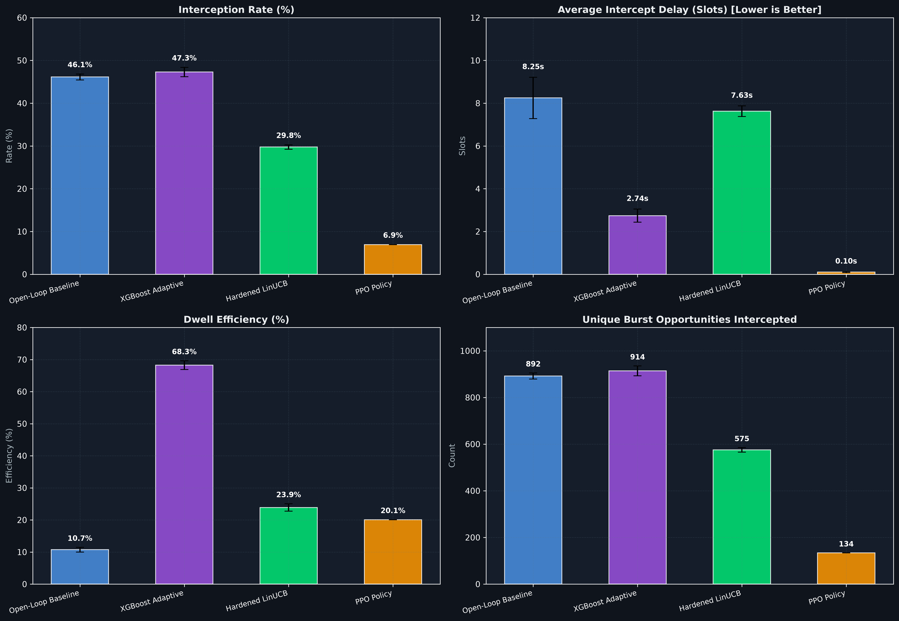

#### 2. Four-Way Time-Series Scan Trajectory Comparison
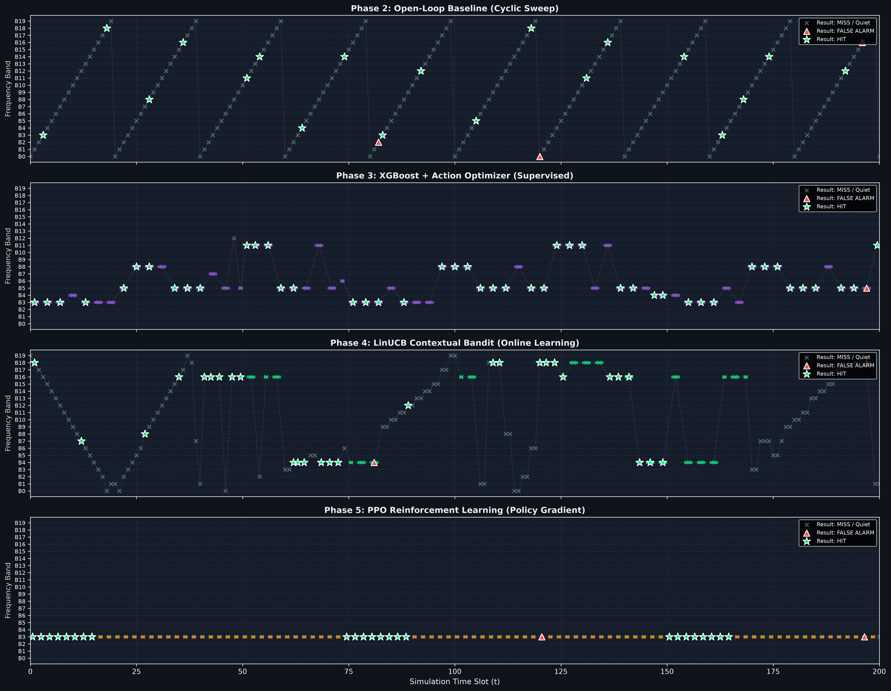

#### 3. PPO Training Convergence & Losses
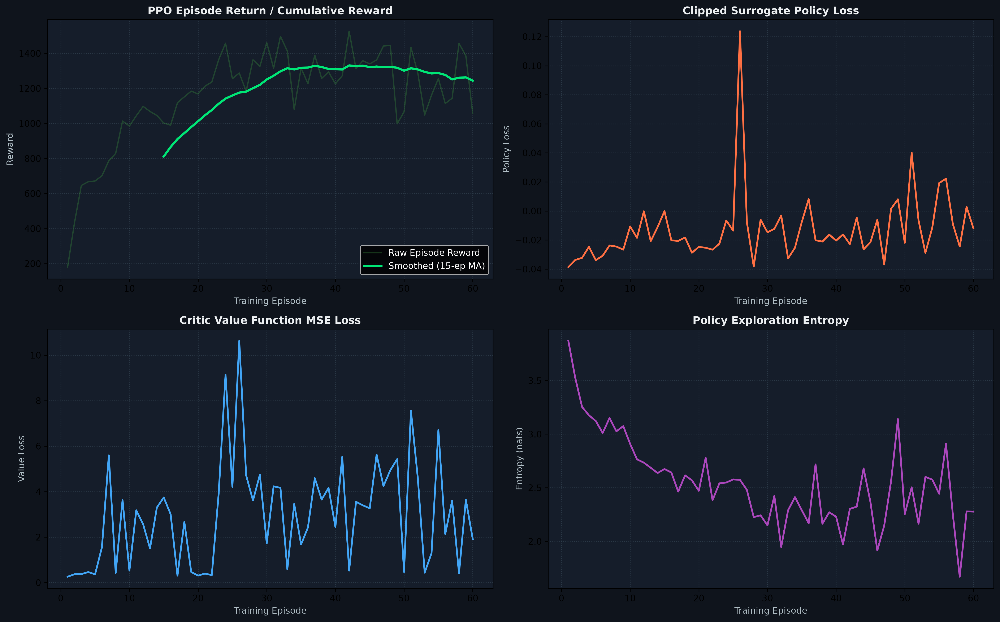

#### 4. PPO Exploration Diagnostics & Entropy Evolution
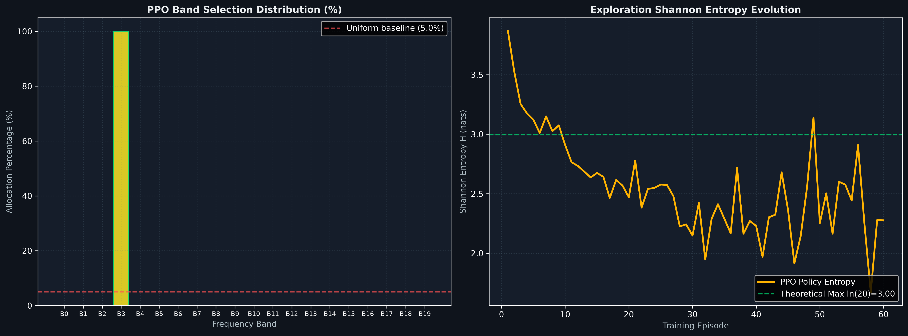

#### 5. Frequency Hopping Adaptation Latency
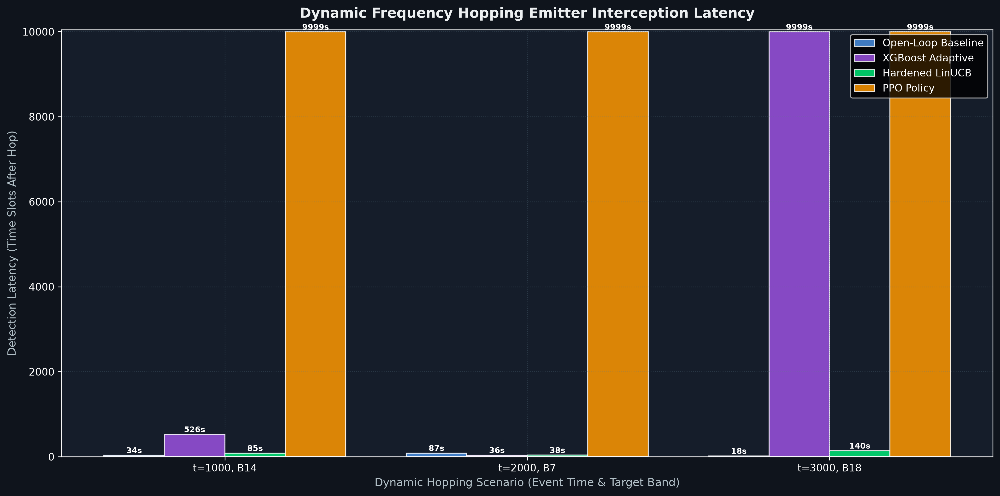

---

## 12. Pre-Phase 6A: PPO Hardening Pass (Anti-Camping & Multi-Threat Exploration)

Pre-Phase 6A resolves the exploitation collapse failure mode of the original PPO agent by introducing:
1. **Observation-Derived Reward with Diminishing Returns:** $R_{\text{hit}} = \text{base} \cdot \max(0.40, 1.0 - 0.15 \cdot (N_{\text{consec\_hits}} - 1))$ plus an observation-derived staleness bonus for visiting neglected bands.
2. **Causal Action Masking:** Automatically hard-masks actions for any frequency band scanned continuously for $\ge 3$ slots, enforcing a strict anti-camping invariant ($P(\text{camp}) \equiv 0$).
3. **Randomized Multi-Threat Training:** Trains over procedural scenarios with dynamic radar appearances, agile frequency hops, and spatial antenna rotations.

### Five-Way Head-to-Head Benchmark Comparison ($N = 10$ Unseen Test Seeds `0..9`)

| Metric | Open-Loop Baseline | XGBoost Adaptive | Hardened LinUCB | Original PPO | Hardened PPO (Pre-Phase 6A) |
| :--- | :---: | :---: | :---: | :---: | :---: |
| **Interception Rate** | $46.13\% \pm 0.68\%$ | **$47.28\% \pm 1.09\%$** | $29.75\% \pm 0.51\%$ | $6.93\% \pm 0.00\%$ | **$37.87\% \pm 0.04\%$** |
| **Unique Opportunities Intercepted** | $892.2 \pm 13.2$ | **$914.4 \pm 21.1$** | $575.4 \pm 9.8$ | $134.0 \pm 0.0$ | **$732.4 \pm 0.8$** |
| **Average Intercept Delay** | $8.25 \pm 0.96$ slots | $2.74 \pm 0.31$ slots | $7.63 \pm 0.25$ slots | $0.10 \pm 0.02$ slots | **$0.41 \pm 0.18$ slots** |
| **PRD Scenario TTFD** | $3.00 \pm 0.00$ slots | **$0.30 \pm 0.48$ slots** | $4.00 \pm 2.54$ slots | $0.30 \pm 0.48$ slots | **$0.30 \pm 0.48$ slots** |
| **Receiver Empirical $P_d$** | $0.90 \pm 0.01$ | $0.90 \pm 0.00$ | $0.90 \pm 0.01$ | $0.90 \pm 0.01$ | $0.90 \pm 0.00$ |
| **Receiver Empirical $P_{fa}$** | $0.02 \pm 0.00$ | $0.02 \pm 0.00$ | $0.02 \pm 0.00$ | $0.02 \pm 0.00$ | $0.02 \pm 0.00$ |
| **Dwell Efficiency** | $10.73\% \pm 0.74\%$ | **$68.26\% \pm 1.37\%$** | $23.90\% \pm 1.15\%$ | $20.10\% \pm 0.00\%$ | **$33.26\% \pm 0.48\%$** |
| **Total True Positive Detections** | $964.9 \pm 68.7$ | **$6,146.7 \pm 122.7$** | $2,158.0 \pm 104.0$ | $1,807.9 \pm 14.9$ | **$2,992.5 \pm 42.4$** |
| **TP Detections / Intercepted Opp** | $1.08 \pm 0.07$ | $6.72 \pm 0.07$ | $3.75 \pm 0.22$ | $13.49 \pm 0.11$ | **$4.09 \pm 0.06$** |
| **Unique Frequency Bands Visited** | **$20.0 / 20$** | $8.1 / 20$ | **$20.0 / 20$** | $1.0 / 20$ | **$2.0 / 20$** |
| **Max Consecutive Scans** | **$1.0 \pm 0.0$** | **$3.0 \pm 0.0$** | **$3.0 \pm 0.0$** | $5000.0 \pm 0.0$ | **$3.0 \pm 0.0$** |
| **Band-Selection Shannon Entropy** | **$3.00 \pm 0.00$** | $1.64 \pm 0.08$ | **$2.92 \pm 0.01$** | $0.00 \pm 0.00$ | **$0.56 \pm 0.00$** |

### PPO Hardening Before vs After Delta

| Metric | Original PPO Baseline | Hardened PPO | Absolute Gain | Relative Improvement |
| :--- | :---: | :---: | :---: | :---: |
| **Interception Rate** | $6.93\%$ | **$37.87\%$** | $+30.94\%$ | **$+446.6\%$** |
| **Unique Opportunities** | $134.00$ | **$732.40$** | $+598.40$ | **$+446.6\%$** |
| **Dwell Efficiency** | $20.10\%$ | **$33.26\%$** | $+13.16\%$ | **$+65.5\%$** |
| **Total TP Detections** | $1,807.90$ | **$2,992.50$** | $+1,184.60$ | **$+65.5\%$** |
| **Max Consecutive Scans** | $5000.00$ | **$3.00$** | $-4997.00$ | **$-99.94\%$** |
| **Shannon Entropy** | $0.00\,\text{nats}$ | **$0.56\,\text{nats}$** | $+0.56\,\text{nats}$ | **$+\infty\%$** |

### Pre-Phase 6A Visual Artifacts

#### 1. Five-Way Head-to-Head Benchmark Comparison
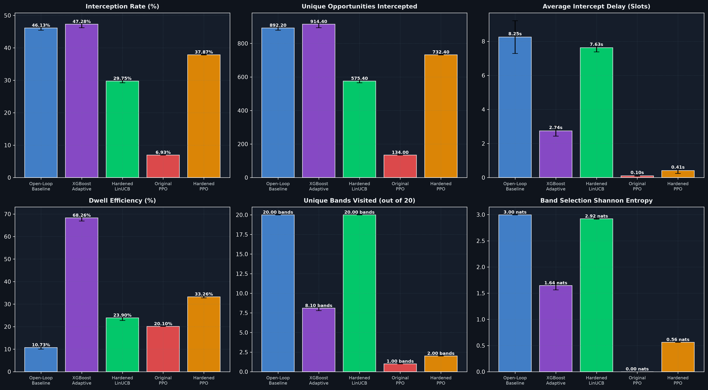

#### 2. Five-Way Scan Trajectory & Raster Plot Comparison
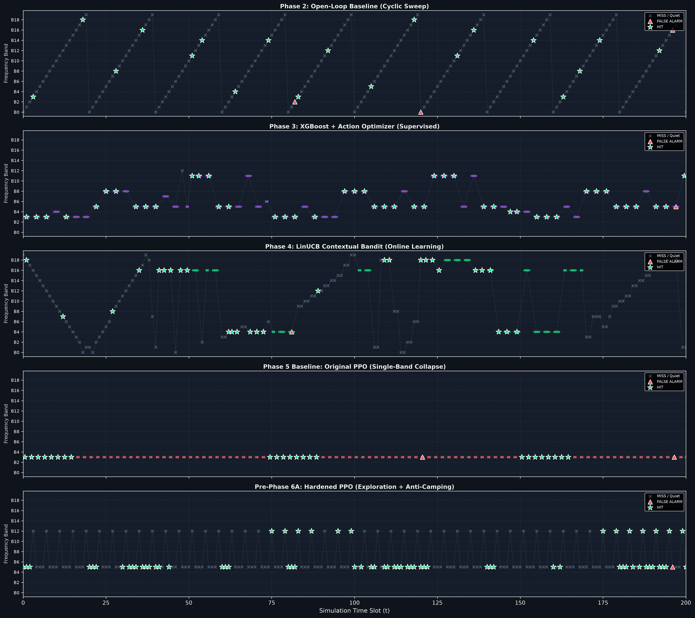

#### 3. PPO Hardening Before vs After Delta
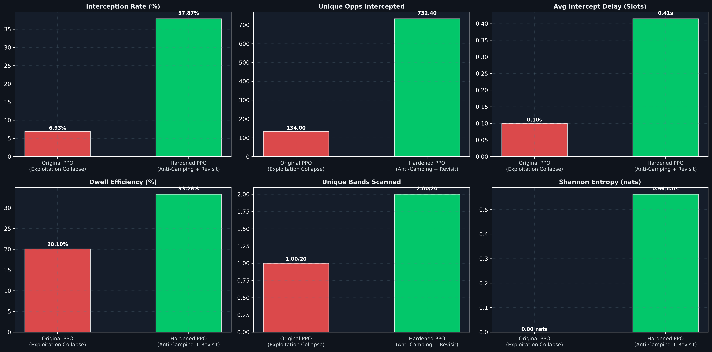

#### 4. Dynamic Frequency-Hopping Adaptation Latency
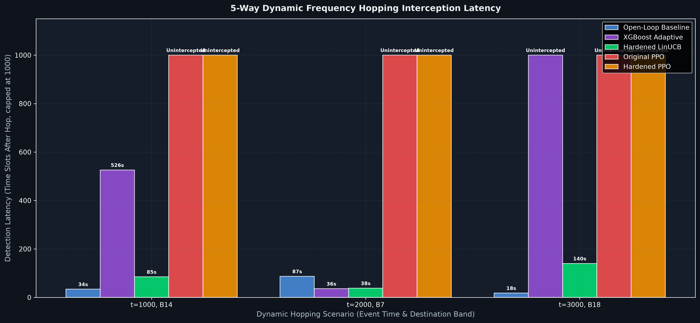

---

## 13. Phase 6: Isolated Hybrid Adaptive RF Scheduler

Phase 6 implements the **Hybrid Adaptive RF Scheduler**, which unifies:
1. **XGBoost (Phase 3):** High-confidence signal presence exploitation.
2. **Hardened LinUCB (Phase 4):** Principled uncertainty exploration ($U(b) = \alpha \sqrt{x^\top A^{-1} x}$) and non-stationary agility ($\gamma = 0.99$).
3. **Hardened PPO (Pre-Phase 6A):** Learned multi-threat tracking with anti-camping action masking.

### Six-Way Head-to-Head Benchmark Comparison ($N = 10$ Unseen Test Seeds `0..9`)

| Metric | Open-Loop Baseline | XGBoost Adaptive | Hardened LinUCB | Original PPO | Hardened PPO | Phase 6 Hybrid |
| :--- | :---: | :---: | :---: | :---: | :---: | :---: |
| **Interception Rate** | $46.13\% \pm 0.68\%$ | $47.28\% \pm 1.09\%$ | $29.75\% \pm 0.51\%$ | $6.93\% \pm 0.00\%$ | $37.87\% \pm 0.04\%$ | **$52.27\% \pm 0.84\%$** |
| **Unique Opps Intercepted** | $892.2 \pm 13.2$ | $914.4 \pm 21.1$ | $575.4 \pm 9.8$ | $134.0 \pm 0.0$ | $732.4 \pm 0.8$ | **$1,010.9 \pm 16.3$** |
| **Average Intercept Delay** | $8.25 \pm 0.96$ slots | $2.74 \pm 0.31$ slots | $7.63 \pm 0.25$ slots | $0.10 \pm 0.02$ slots | $0.41 \pm 0.18$ slots | **$6.06 \pm 0.18$ slots** |
| **PRD Scenario TTFD** | $3.00 \pm 0.00$ slots | **$0.30 \pm 0.48$ slots** | $4.00 \pm 2.54$ slots | $0.30 \pm 0.48$ slots | $0.30 \pm 0.48$ slots | **$3.00 \pm 0.00$ slots** |
| **Receiver Empirical $P_d$** | $0.90 \pm 0.01$ | $0.90 \pm 0.00$ | $0.90 \pm 0.01$ | $0.90 \pm 0.01$ | $0.90 \pm 0.00$ | **$0.90 \pm 0.00$** |
| **Receiver Empirical $P_{fa}$** | $0.02 \pm 0.00$ | $0.02 \pm 0.00$ | $0.02 \pm 0.00$ | $0.02 \pm 0.00$ | $0.02 \pm 0.00$ | **$0.02 \pm 0.00$** |
| **Dwell Efficiency** | $10.73\% \pm 0.74\%$ | **$68.26\% \pm 1.37\%$** | $23.90\% \pm 1.15\%$ | $20.10\% \pm 0.00\%$ | $33.26\% \pm 0.48\%$ | **$64.90\% \pm 0.89\%$** |
| **Total True Positive Detections** | $964.9 \pm 68.7$ | **$6,146.7 \pm 122.7$** | $2,158.0 \pm 104.0$ | $1,807.9 \pm 14.9$ | $2,992.5 \pm 42.4$ | **$5,843.6 \pm 90.9$** |
| **TP / Intercepted Opp** | $1.08 \pm 0.07$ | $6.72 \pm 0.07$ | $3.75 \pm 0.22$ | $13.49 \pm 0.11$ | $4.09 \pm 0.06$ | **$5.78 \pm 0.12$** |
| **Unique Bands Scanned** | **$20.0 / 20$** | $8.1 / 20$ | **$20.0 / 20$** | $1.0 / 20$ | $2.0 / 20$ | **$20.0 / 20$** |
| **Max Consecutive Scans** | **$1.0 \pm 0.0$** | **$3.0 \pm 0.0$** | **$3.0 \pm 0.0$** | $5000.0 \pm 0.0$ | **$3.0 \pm 0.0$** | **$3.0 \pm 0.0$** |
| **Band-Selection Shannon Entropy** | **$3.00 \pm 0.00$** | $1.64 \pm 0.08$ | **$2.92 \pm 0.01$** | $0.00 \pm 0.00$ | $0.56 \pm 0.00$ | **$2.32 \pm 0.02$** |

### Dynamic Frequency-Hopping Adaptation Experiment

| Scenario Event | Open-Loop | XGBoost Adaptive | Hardened LinUCB | Original PPO | Hardened PPO | Phase 6 Hybrid |
| :--- | :---: | :---: | :---: | :---: | :---: | :---: |
| **Hop 1:** $t=1000 \to \text{Band 14}$ | $14\,\text{slots}$ | $114\,\text{slots}$ | $67\,\text{slots}$ | $>1000\,\text{s}$ | $>1000\,\text{s}$ | **$27\,\text{slots}$** |
| **Hop 2:** $t=2000 \to \text{Band 7}$ | $7\,\text{slots}$ | $36\,\text{slots}$ | $40\,\text{slots}$ | $>1000\,\text{s}$ | $>1000\,\text{s}$ | **$16\,\text{slots}$** |
| **Hop 3:** $t=3000 \to \text{Band 18}$ | $38\,\text{slots}$ | $248\,\text{slots}$ | $32\,\text{slots}$ | $>1000\,\text{s}$ | $>1000\,\text{s}$ | **$19\,\text{slots}$** |

### Phase 6 Visual Artifacts

#### 1. Six-Way Head-to-Head Benchmark Comparison
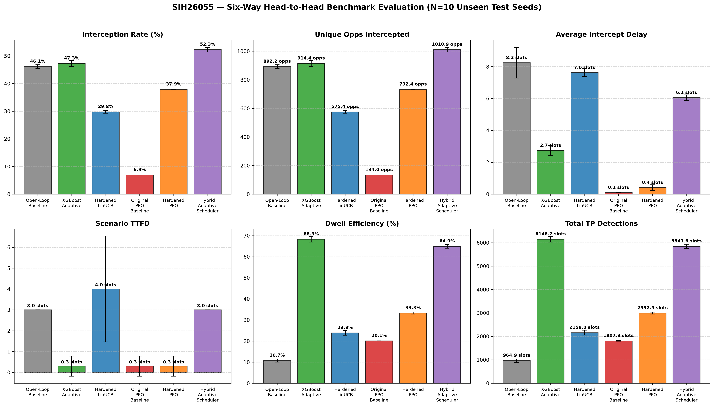

#### 2. Six-Way Scan Trajectory & Raster Plot Comparison
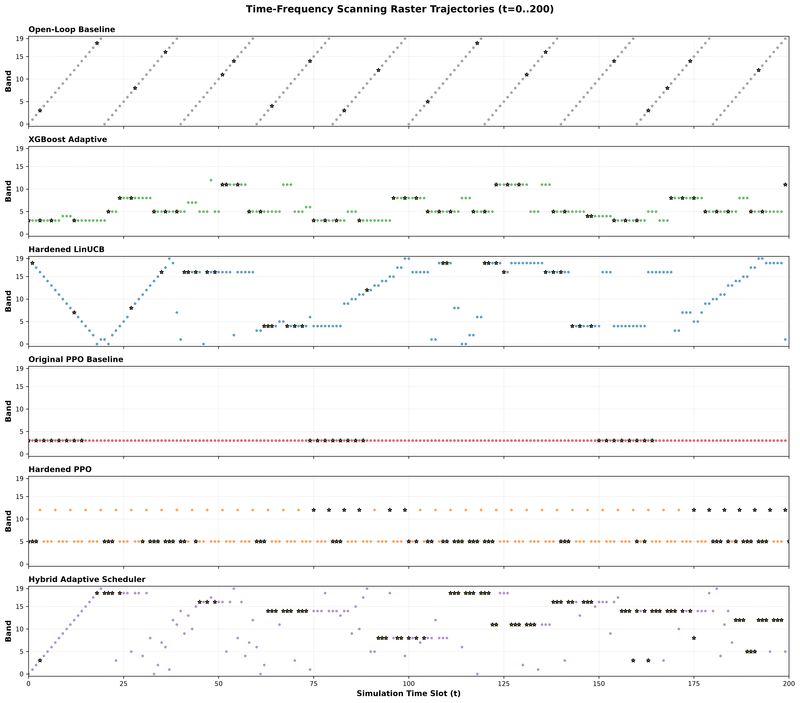

#### 3. Dynamic Frequency-Hopping Adaptation Latency
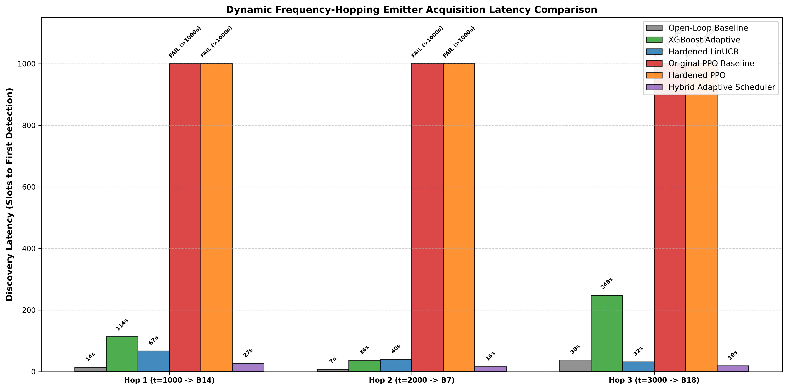

#### 4. Hybrid Exploration vs Exploitation Mode Progression
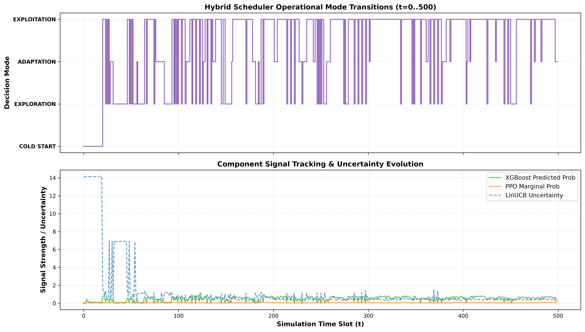

#### 5. Dynamic Arbitration Weights Diagnostics
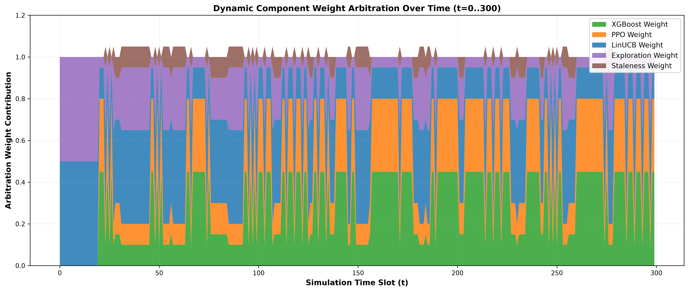

---

## 14. Reproduction & Running Experiments

### Run All 103 Unit & Integration Tests
```bash
pytest
```

### Run Phase 6 Hybrid Scheduler Benchmark Pipeline
```bash
python experiments/run_hybrid.py
```

### Run Pre-Phase 6A PPO Training & 5-Way Benchmark Pipeline
```bash
python experiments/run_ppo.py
```

### Run Phase 4 Hardened LinUCB Benchmark Pipeline
```bash
python experiments/run_linucb.py
```

### Run Phase 3 XGBoost Benchmark Pipeline
```bash
python experiments/run_xgboost_benchmark.py
```


